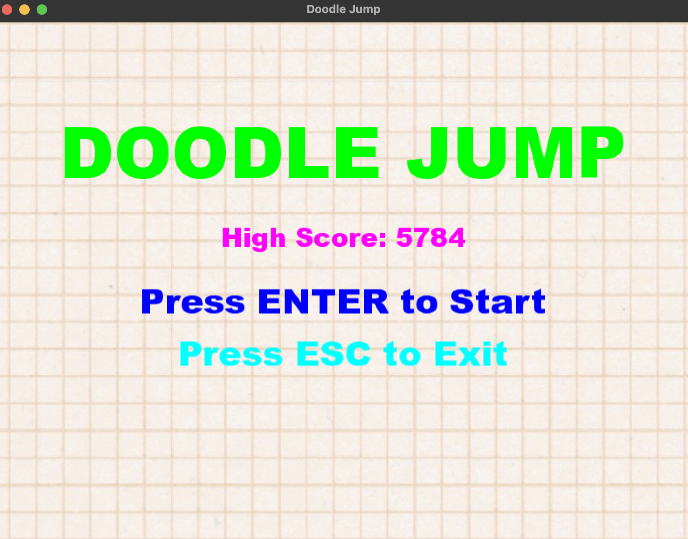
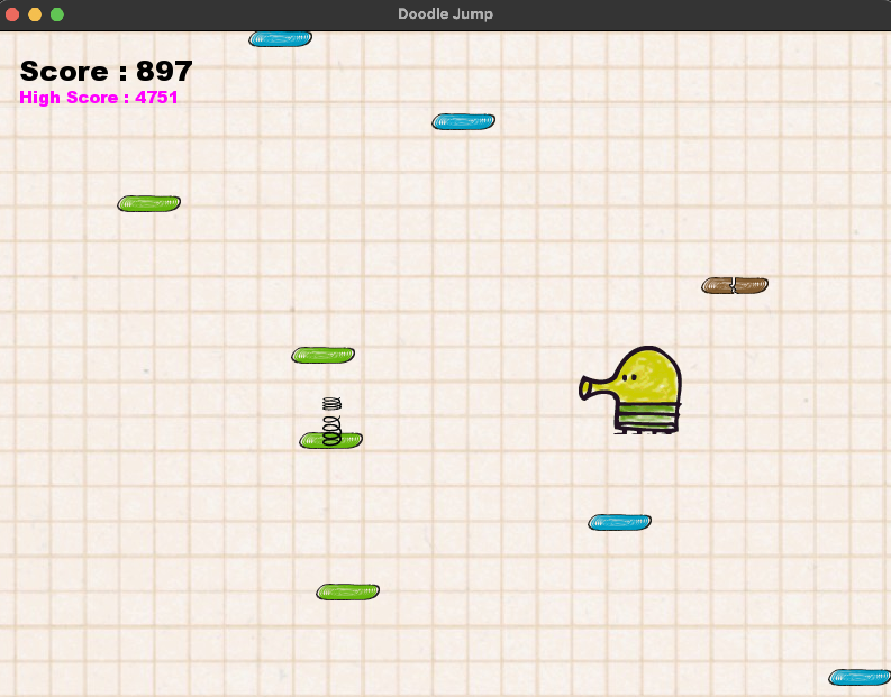
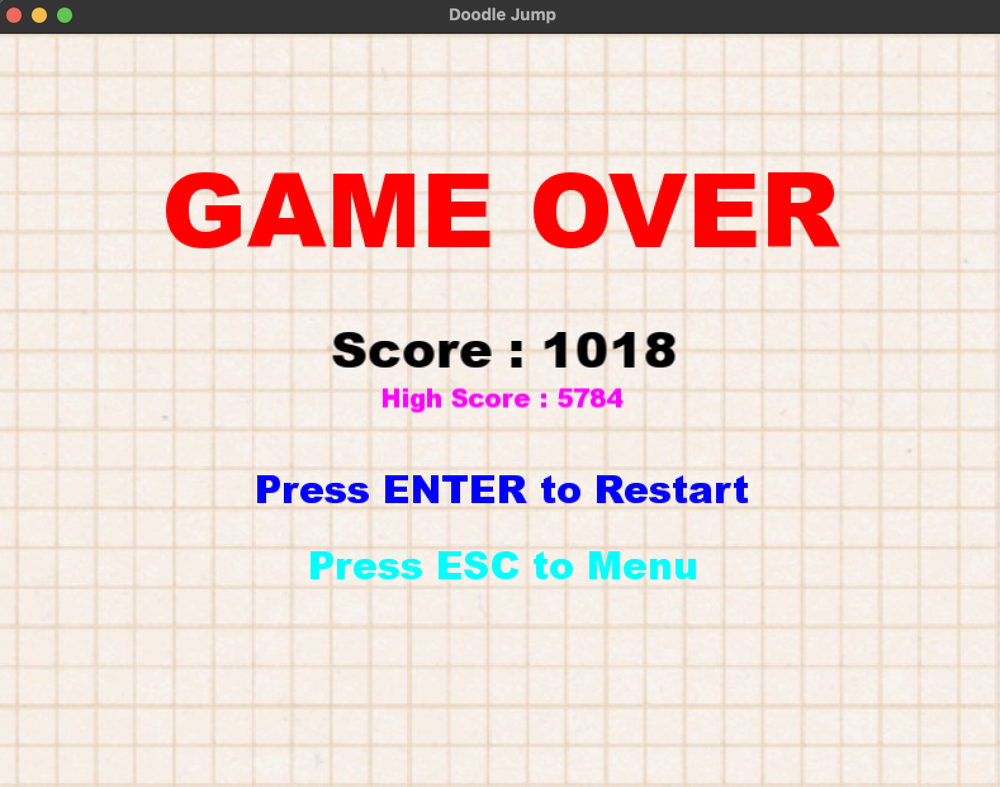

# 🎮 Doodle Jump

A modern object-oriented implementation of the classic **Doodle Jump** game written in **C++** using **SFML**. The project is built with **CMake** and follows a modular architecture to keep the code maintainable, scalable, and easy to extend.

---

## ✨ Overview

This project recreates the core mechanics of the original Doodle Jump while focusing on clean software design and modern C++ practices. The game includes multiple platform types, score tracking, camera movement, collision handling, menus, and persistent high scores.

The codebase is organized into independent modules, making it easy to add new gameplay mechanics and features in future versions.

---

## 🚀 Features

* Classic Doodle Jump gameplay
* Object-Oriented Design
* Modular project structure
* Multiple platform types

  * Normal Platform
  * Moving Platform
  * Broken Platform
* Camera system following the player
* Collision management
* Score system
* Persistent high score
* Main menu
* Game over screen
* Pause functionality
* Resource manager for textures and fonts
* Configurable game states
* Built using CMake

---

## 🏗️ Project Structure

```
DoodleJump
│
├── assets/                # Sprites and game textures
├── fonts/                 # Game fonts
│
├── include/
│   ├── Core/
│   │   ├── Config.hpp
│   │   ├── GameState.hpp
│   │   ├── GameStateManager.hpp
│   │   ├── HighScoreManager.hpp
│   │   └── ResourceManager.hpp
│   │
│   ├── Physics/
│   ├── Platform/
│   ├── UI/
│   │
│   ├── Camera.hpp
│   ├── CollisionManager.hpp
│   ├── Game.hpp
│   ├── Player.hpp
│   └── ScoreManager.hpp
│
├── src/
│   ├── Core/
│   ├── Platform/
│   ├── UI/
│   └── main.cpp
│
├── CMakeLists.txt
└── .gitignore
```

---

## 🛠️ Technologies Used

* C++17
* SFML
* CMake
* Object-Oriented Programming (OOP)

---

## ⚙️ Requirements

Before building the project, make sure you have installed:

* C++17 compatible compiler
* CMake (3.15 or newer)
* SFML

---

## 🔨 Build Instructions

Clone the repository:

```bash
git clone https://github.com/m-mahdi-jafari-yazani/DoodleJump.git
cd DoodleJump
```

Create a build directory:

```bash
mkdir build
cd build
```

Generate the build files:

```bash
cmake ..
```

Compile the project:

```bash
make
```

Run the game:

```bash
./DoodleJump
```

---

## 🎮 Controls

| Key                 | Action                                   |
| ------------------- | ---------------------------------------- |
| **←** / **A**       | Move Left                                |
| **→** / **D**       | Move Right                               |
| **Enter**           | Start the game / Restart after Game Over |
| **Esc**             | Pause the game                           |
| **Esc** (Game Over) | Return to the Main Menu                  |

> **Note:** The player jumps automatically upon landing on a platform, just like in the original *Doodle Jump*.

---

## 🧩 Design

The project is divided into independent modules:

### Core

Responsible for:

* Game states
* Configuration
* High score management
* Resource management

### Platform

Implements all platform types using inheritance.

Current platform types:

* Normal Platform
* Moving Platform
* Broken Platform

A Platform Factory is used to create different platform objects.

### Physics

Contains the player's physics state and movement logic.

### UI

Responsible for:

* Main Menu
* HUD
* Game Over Screen

### Camera

Keeps the player centered while moving upward.

### Collision

Handles collisions between the player and platforms.

---

## 📈 Future Improvements

The project is designed to be extended.

Planned features include:

* Background music
* Sound effects
* Power-ups
* Enemy system
* Pause menu
* Settings menu
* Animations
* Additional platform types
* Particle effects
* Save game support
* Difficulty levels

---

## 📸 Screenshots

### Main Menu



### Gameplay



### Game Over



---

## 📌 Development Workflow

The project is managed using Git and GitHub.

Each new feature is developed in its own branch:

```
main
│
├── feature/powerups
├── feature/settings
├── feature/music
├── feature/enemies
└── feature/pause-menu
```

Every feature is committed separately before being merged into the `main` branch.

---

## 🤝 Contributing

Contributions, suggestions, and bug reports are always welcome.

If you'd like to improve the project:

1. Fork the repository.
2. Create a feature branch.
3. Commit your changes.
4. Open a Pull Request.

---

## 👨‍💻 Author

**Mohammad Mahdi Jafari Yazani**

GitHub: [m-mahdi-jafari-yazani](https://github.com/m-mahdi-jafari-yazani)

---

## 📄 License

This project is licensed under the MIT License.

See the LICENSE file for more information.
